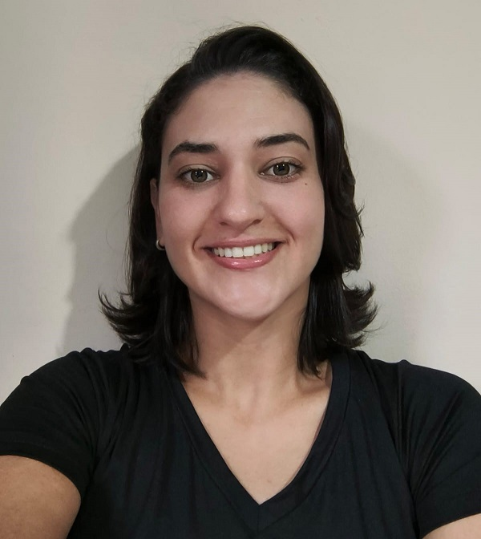

Olá! Sou estudante de Engenharia da Computação na Univesp e estou cursando o 3° semestre. Atualmente resido na cidade de Bariri, estado de São Paulo. Na área da tecnologia, a unica experiência que tive foi as atividades realizadas durante as aulas da faculdade mas me interesso pelo desenvolvimento profissonal e pessoal nessa área, principalmente pela facilidade com tecnologia que possuo.

Durante dois anos lecionei Ciências no ensino fundamental na cidade que resido, o que me ajudou a aprimorar minhas habilidades de comunicação, didática e paciência. Além de reforçar caracteristicas pessoais como proatividade, persistência e organização.

No meu tempo livre, gosto de ciclismo, academia, corrida ao ar livre e leitura, atividades que me ajudam a manter a mente ativa e equilibrar a rotina.

## Sprints 

1. [Sprint_1](./Sprint%201)
2. [Sprint_2](./Sprint%202)
3. [Sprint_3](./Sprint%203/)
4. [Sprint_4](./Sprint%204/)
5. [Sprint_5](./Sprint%205/)
6. [Sprint 6](./Sprint%206/)
7. [Sprint 7](./Sprint%207/)
8. [Sprint 8](./Sprint%208/)
9. [Sprint 9](./Sprint%209/)
10. [Sprint10]
