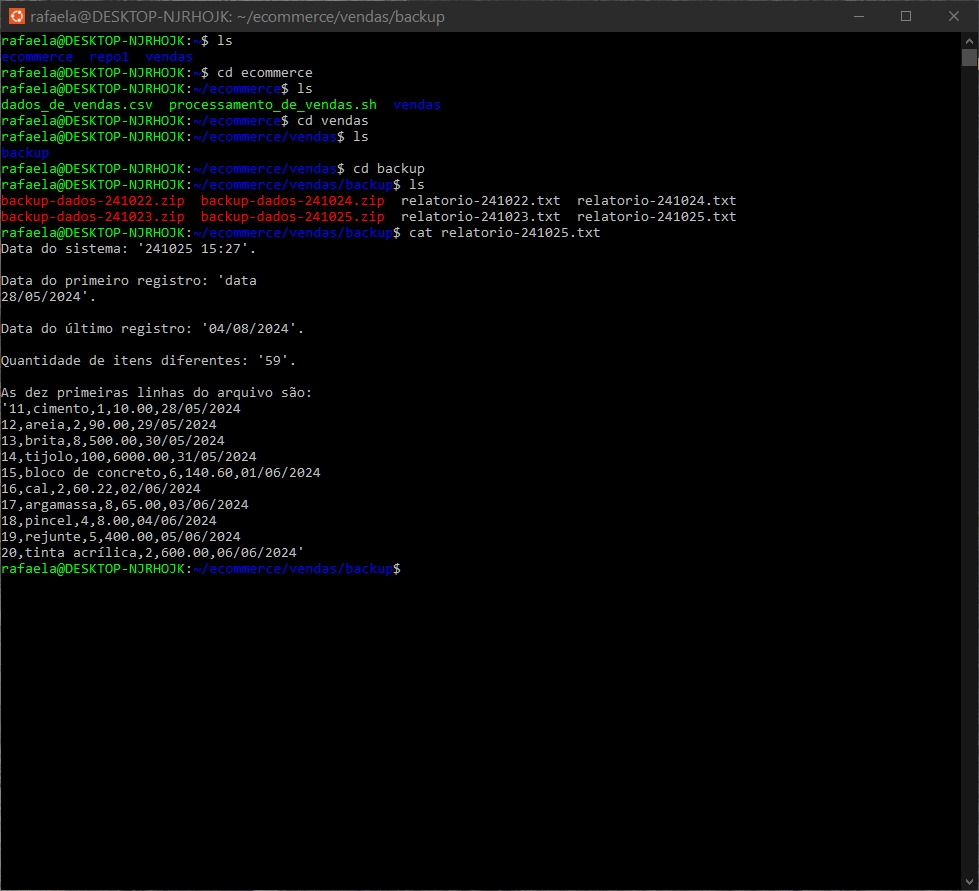

# Resumo e Objetivo
O desafio da Sprint 01 teve como objetivo criar um script executável em linux que gerasse um relatório final, unindo relatórios que foram gerados por outro script executável, esse por sua vez, foi programado e rodou por quatro dias seguidos, criando relatórios diários.

Foi fornecido um arquivo dados_de_vendas.csv, de onde foi extraido os dados para a produção do primeiro relatório, para os demais relatórios, foi alterado manualmente os dados do arquivo dados_de_vendas.csv, gerando assim, diariamente relatórios com informações diferentes.

# Etapas da criação dos scripts executáveis
Em ambos os executáveis, fui escrevendo e testando manualmente cada parte isolada, com o intuito de ir corrigindo os erros de sintax e pontuações durante o processo de escrita.

O primeiro script, [Etapa I](../Desafio/Etapa-1) ficou responsável por criar diretórios, subdiretórios, renomear o arquivo e criar os relatórios diários.

Já o segundo script, [Etapa II](../Desafio/Etapa-2) ficou responsável por unir os relatórios diários em um único relatório final.

## Script01... [Etapa I](../Desafio/Etapa-1)

1. Ao criar o arquivo Processamento_de_vendas.sh, não estava conseguindo editá-lo, ao mudar as configurações de permissão o probelma foi resolvido. 


2. Comecei a criação do executável criando um cabeçalho onde há informações importantes como nome do autor, breve descrição da função do script e como ele será executado.


3. Após isso, dei inícios aos comandos de criação de diretório, subdiretório e realização da cópia do arquivo dados_de_vendas.csv para dentro do diretório, sendo utilizado o código:
```linux
 DIRETORIO_VENDAS="/home/rafaela/ecommerce/vendas"
if [ -d "$DIRETORIO_VENDAS" ]; then
    echo "O diretório vendas já existe"
else
    mkdir "$DIRETORIO_VENDAS"
    echo "Diretório vendas criado"
fi

if [ -d "$SUBDIR_BACKUP" ]; then
    echo "O subdiretório backup já existe"
else
    mkdir "$SUBDIR_BACKUP"
    echo "Subdiretório backup criado"
fi

ARQUIVOS_DADOS="/home/rafaela/ecommerce/dados_de_vendas.csv"
cp "$ARQUIVOS_DADOS" "vendas"
echo "Arquivo dados_de_vendas copiado para o diretório vendas"
```

Tendo como saída


4. Logo após, é realizado a cópia do arquivo dados_de_vendas para apasta backup e a renomeação do arquivo para o formato dados-yyyymmdd. Para isso foi necessário obter a data de execução para adicioná-a ao título a travéz do comando date.

```linux
DATA_EXECUCAO=$(date +"%y%m%d")
```
    


5. Na sequencia foi realizado uma nova renomeação para o formato backup-dados-yyyymmdd, sendo que a função mv foi usada para isso.
```linux
BACKUP_DADOS="backup-dados-$DATA_EXECUCAO.csv"
if [ -f "$SUBDIR_BACKUP/$NOVO_ARQUIVO_BACKUP" ]; then
    mv "$SUBDIR_BACKUP/$NOVO_ARQUIVO_BACKUP" "$SUBDIR_BACKUP/$BACKUP_DADOS"
    echo "Arquivo '$NOVO_ARQUIVO_BACKUP' renomeado para '$BACKUP_DADOS' dentro do diretório '$SUBDIR_BACKUP'."
else
    echo "Arquivo '$NOVO_ARQUIVO_BACKUP' não encontrado."
fi 
```

    
6. Declarei variáveis que armazenam as informações necessárias para a criação do relatório e testei se a saída estavam corretas.


Fiz alteração na quantidade de itens, para que buscasse nomente os dez primeiros itens.
```
QUANT_ITENS_DIF=$( tail -n +2 "$ARQUIVO" | cut -d, -f2  | sort -u | wc -l)
```

7. Para a criação e adição das informações no relatório,utilizei o seguinte código:
``` 
RELATORIO_TXT="relatorio-$DATA_EXECUCAO.txt"
touch "$SUBDIR_BACKUP/$RELATORIO_TXT"
{
echo "Data do sistema: '$DATA_RELATORIO'. "
echo""
echo "Data do primeiro registro: '$DATA_PRIM_REGISTRO'."
echo""
echo "Data do último registro: '$DATA_ULT_REGISTRO'."
echo""
echo "Quantidade de itens diferentes: '$QUANT_ITENS_DIF'."
echo""
echo "As dez primeiras linhas do arquivo são:"
echo "'$DEZ_PRIMEIRAS_LINHAS'"
} > "$SUBDIR_BACKUP/$RELATORIO_TXT"
```
8. Após a criação do relatório, foi solicitado a compactação do arquivo backup-dados-yyyymmdd em zip. Nesse momento, tive problemas com o Linux.


 Precisando realizar os seguintes comandos para resolver.
```
    sudo apt update
    sudo apt install zip
```
Resolvendo assim o problema.


9. Em seguida, foi solicitado que apagasse o arquivo backup-dados-yyyymmdd.txt de backup e o arquivo dados_de_vendas.txt de vendas, sendo realizado pelo seguinte código.
```
rm "$NOME_ARQ_CSV"
if [ -f "$NOME_ARQ_CSV" ]; then
        echo "Arquivo '$NOME_ARQ_CSV' não apagado"
else
        echo "Arquivo '$NOME_ARQ_CSV' apagado"
fi
rm "$ARQUIVO_DADOS_VEND"
if [ -f "$ARQUIVO_DADOS_VEND" ]; then
        echo "Arquivo '$ARQUIVO_DADOS_VEND' não apagado"
else
        echo "Aquivo '$ARQUIVO_DADOS_VEND' apagado"
fi
echo""
```
Tendo como saída:


10. Para programar o script processamento_de_vendas.sh usei o crontab, programando as 15:27.


11. Após a sexecução programada, fui abrindo cada relatorio e verificando a execução do script.

👉Primeiro dia:

👉Segundo dia:

👉Terceiro dia:

👉Quarto dia:


仇듀pós a execução do terceiro dia (24/10/24), ao conversar com meus colegas, percebi que quando mudei manualmente os dados, não alterei os id de cada produto, sendo assim, alterei manualmente antes da execução do dia 25/10/24.

Executei novamente o script por 4 vezes  consecutivas a cada 5 minutos, tendo todo o conteúdo do arquivo dados_de_vendas alterados completamente, gerando assim novos relatórios e um novo relatório final, assim como consta na pasta
📂 [Novos_relatórios](/Sprint%201/Evidencias/Novos_relatorios).


## Script02... [Etapa II](../Desafio/Etapa-2)

Comecei pensando em criar o relatório final na pasta ecommerce com a seguinte linha de código.
```
RELAT="relat_final.txt"
touch "$RELAT"
if [ -f "/home/rafaela/repo1/relat_final.txt" ]; then
        echo "Relatório criado"
else
        echo "Relatório não criado"
fi
```


Em seguida, realizei uma busca no diretório backup, para encontrar todos os arquivos do tipo .txt, copiando assim seu conteudo para dentro do relatório final, sempre abaixo do relatório anteriormente adicionado.

Para isso, usei o seguinte loop.
```
for relatorio in "$SUBDIR"/*.txt ; do
        cat "$relatorio" >> "$RELAT"
done

echo "Arquivos relatorios unidos em '$RELAT'."
```


Tendo então a criação do relatório final.

📑[Relatório final](/Sprint%201/Desafio/Etapa-2/relatorio_final.txt)
