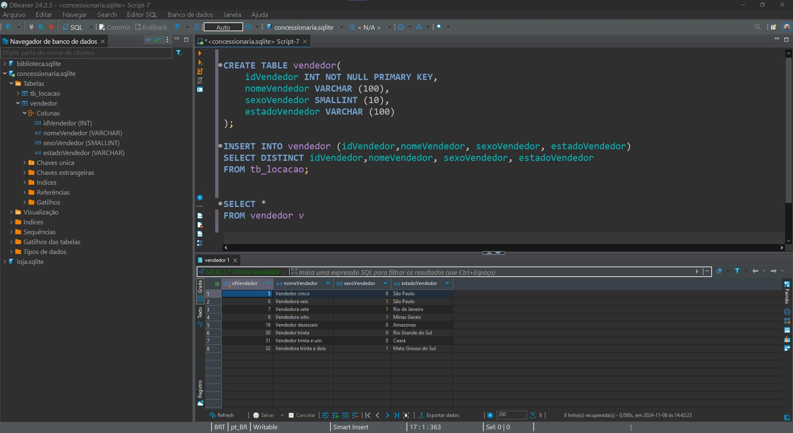
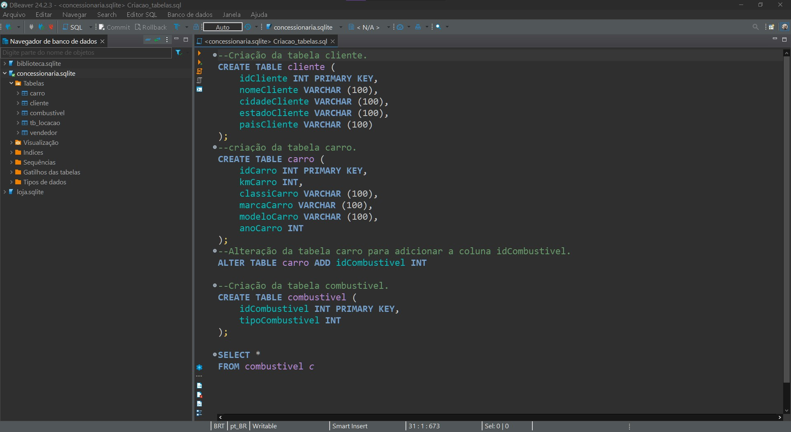

# Objetivo Desafio

# Entregaveis 
- Passos da normalização.
- Desenho da Modelagem Relacional após a normalização.
- Desenho da Modelagem Dimencional.

# Etapas

## [Etapa01](../Desafio/etapa-1/)
1. Após receber o arquivo concessionaria.zip, descompactei e abri o arquivo concessionaria.sqlite pelo Dbeaver.

Analisando a tabela e as colunas, achei melhor fazer uma modelagem pelo Dbdesigner para vizualizar melhor quais tabelas precisaria criar e quais dados precisaria normalizar.

Tive então um rascunho inicial para organizar o pensamento: [Rascunho_modelagem](../Evidencias/Modelagem_inicial.jpg)

2. Em seguida, dei inicio a criação das tabelas e a normalização dos dados, fazendo as relações entre as tabelas.

Nesse momento tive muita dificulade com a sintax e quais comandos usar, achei necessário realizar uma busca em outros materiais para conseguir entender melhor como fazer.

3. Após pesquisar em outros cursos da Udemy e por fora da plataforma, comecei criando a tabela vendedor e adicionando as colunas correspondentes a essa tabela, inseri os idVendedor, porém, quando fui inserir a chhave estrangeira na tb_locacao, apareceu um erro.

❌[Query erro](../Desafio/etapa-1/Erro_foreign_key.sql)

Após conversar e pesquisar sobre o erro, achei melhor continuar criando as outras tabelas, para depois criar novamente a tabela locação e então fazer as conexões entre tabelas.

4. Continuei criando as tabelas e normalizar os dados.

[Tabela Vendedor](../Desafio/etapa-1/Tb_vendas.sql)

[Criação demais tabelas (cliente, carro e combustivel)](../Desafio/etapa-1/Criacao_tabelas.sql)

5. Achei melhor ja criar também uma segunda tabela locação, para que eu possa adicionar as chaves estrangeiras e fazer as alterações necessárias nas colunas.

