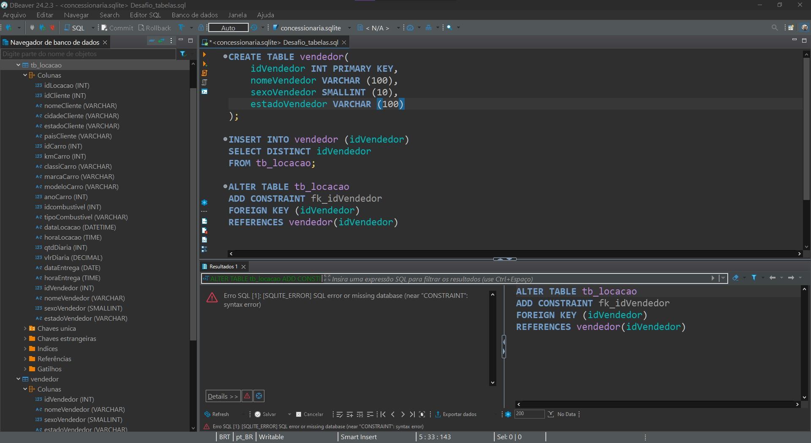

# Objetivo Desafio

# Entregaveis 
- Passos da normalização.
- Desenho da Modelagem Relacional após a normalização.
- Desenho da Modelagem Dimencional.

# Etapas

## [Etapa01](../Desafio/etapa-1/)
1. Após receber o arquivo concessionaria.zip, descompactei e abri o arquivo concessionaria.sqlite pelo Dbeaver.

Analisando a tabela e as colunas, achei melhor fazer uma modelagem pelo Dbdesigner para vizualizar melhor quais tabelas precisaria criar e quais dados precisaria normalizar.

Tive então um rascunho inicial para organizar o pensamento: [Rascunho_modelagem](../Evidencias/Modelagem_inicial.jpg)

2. Em seguida, dei inicio a criação das tabelas e a normalização dos dados, pensei em ja fazer a relaçõa entre as tabelas novas e a tb_locação.

Nesse momento tive muita dificulade com a sintax e quais comandos usar, achei necessário realizar uma busca em outros materiais para conseguir entender melhor como fazer.

3. Após pesquisar em outros cursos da Udemy e por fora da plataforma, comecei criando a tabela vendedor e adicionando as colunas correspondentes a essa tabela, porém, quando fui inserir a chhave estrangeira na tb_locacao, apareceu um erro.

Após conversar e pesquisar sobre o erro,  entendi que essa tabela tb_locacao não seria possível alterar, então, comecei criando novas tabelas para normalizar todos os dados.

4. Criei primeiro todas as tabelas necessárias, para então ir transferindo os dados da Antiga_tb_locacao.

