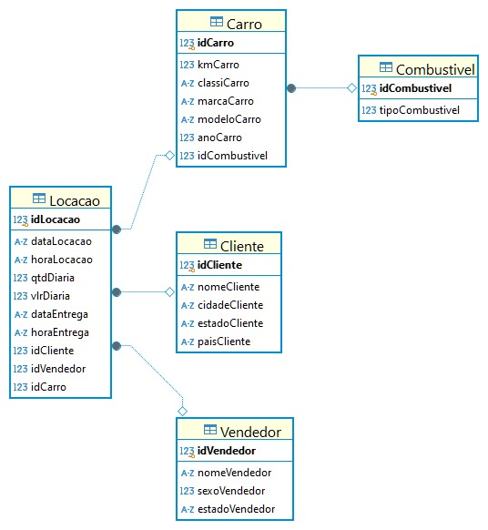

# Objetivo Desafio

# Entregaveis 
- Passos da normalização.
- Desenho da Modelagem Relacional após a normalização.
- Desenho da Modelagem Dimencional.

# Etapas
Após ler diversas vezes e assistir ao video explicativo do desafio, entendi o que era necessário fazer para a conclusão do desafio.

## [Etapa01](../Desafio/etapa-1/)
1. Após receber o arquivo concessionaria.zip, descompactei e abri o arquivo concessionaria.sqlite pelo Dbeaver.

Analisando a tabela e as colunas, achei melhor fazer uma modelagem pelo Dbdesigner para vizualizar melhor quais tabelas precisaria criar e quais dados precisaria normalizar.

Tive então um rascunho inicial para organizar o pensamento: [Rascunho_modelagem](../Evidencias/Modelagem_inicial.jpg)

2. Em seguida, dei inicio a criação das tabelas e a normalização dos dados, pensei em ja fazer a relação entre as tabelas novas e a tb_locação.

Nesse momento tive muita dificulade com a sintax e quais comandos usar, achei necessário realizar uma busca em outros materiais para conseguir entender melhor como fazer.

3. Após pesquisar em outros cursos da Udemy e por fora da plataforma, comecei criando a tabela vendedor e adicionando as colunas correspondentes a essa tabela, porém, quando fui inserir a chave estrangeira na tb_locacao, apareceu um erro.

Após conversar e pesquisar sobre o erro,  entendi que essa tabela tb_locacao não seria possível alterar, então, comecei criando novas tabelas para normalizar todos os dados.

4. Para criar o arquivo [Etapa01_relacional](../Desafio/etapa-1/Etapa01_Relacional.sql), comecei criando primeiro todas as tabelas necessárias, para então ir transferindo os dados da Antiga_tb_locacao para as novas e em seguida, alterando as tabelas conforme o necessário.

Percebi que haviam vários dados duplicados, o tipo date e time também precisaram ser alterados para uma melhor formatação.

Teve um momento onde percebi que os dados da coluna kmCarro estavam iconsistentes, não seria possível colocar todos os registros na tabela Carro, nesse momento optei por selecionar a última kilometragem de cada idCarro.

Tendo como resultado o desenho relacional.

## [Etapa02](../Desafio/etapa-2/)

Assim como falado no vídeo Explicação Desafio (Seção8, Desafio da Sprint 2), criei um novo código para fazer as alterações necessárias para criar o modelo dimencional.

1. 

