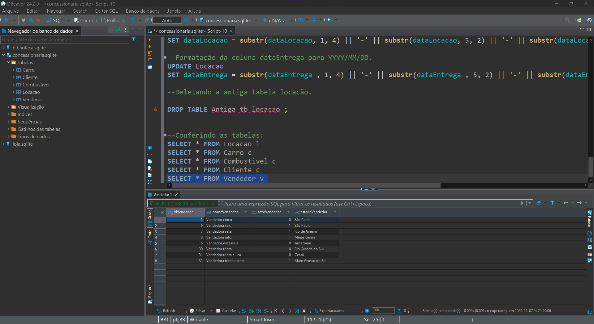
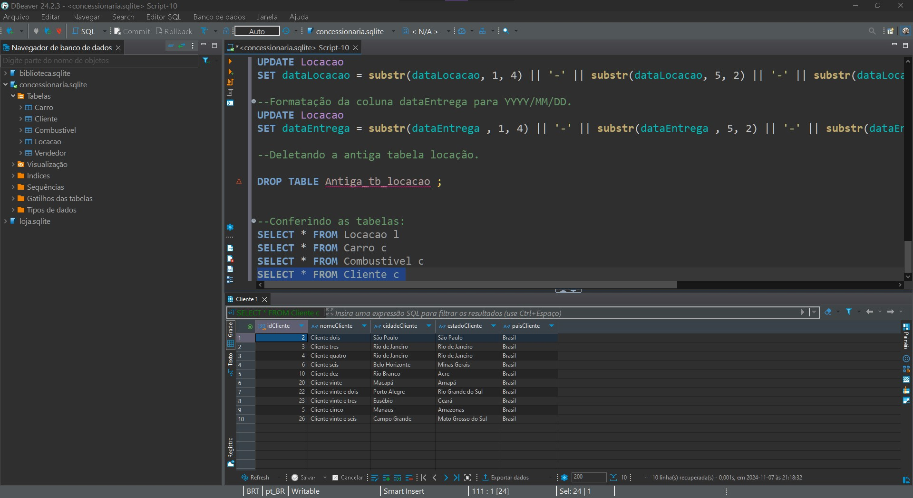
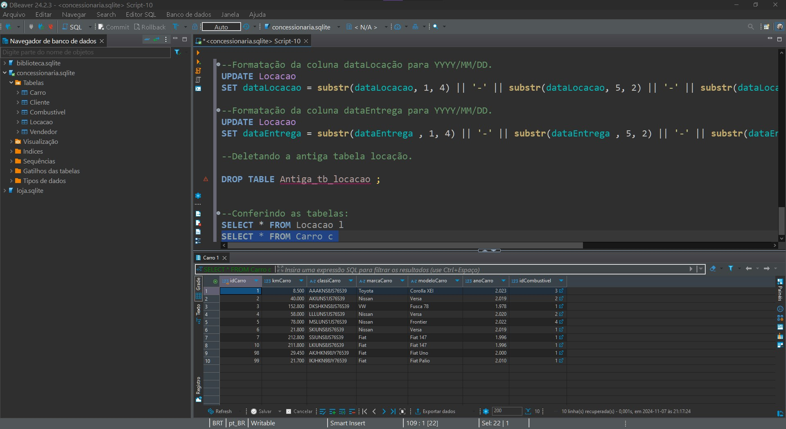
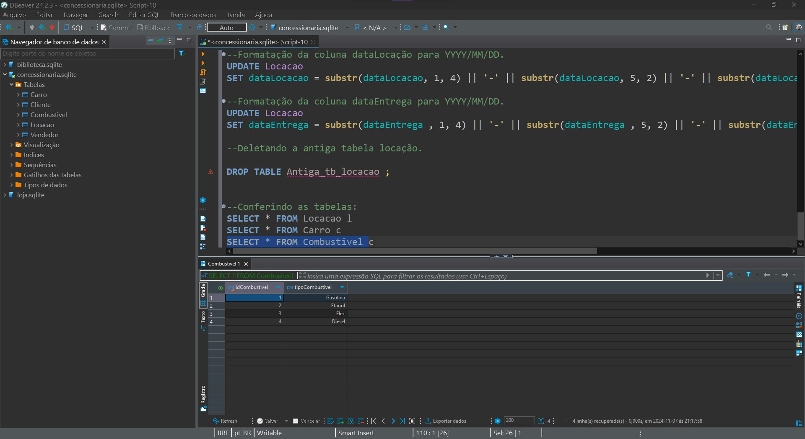
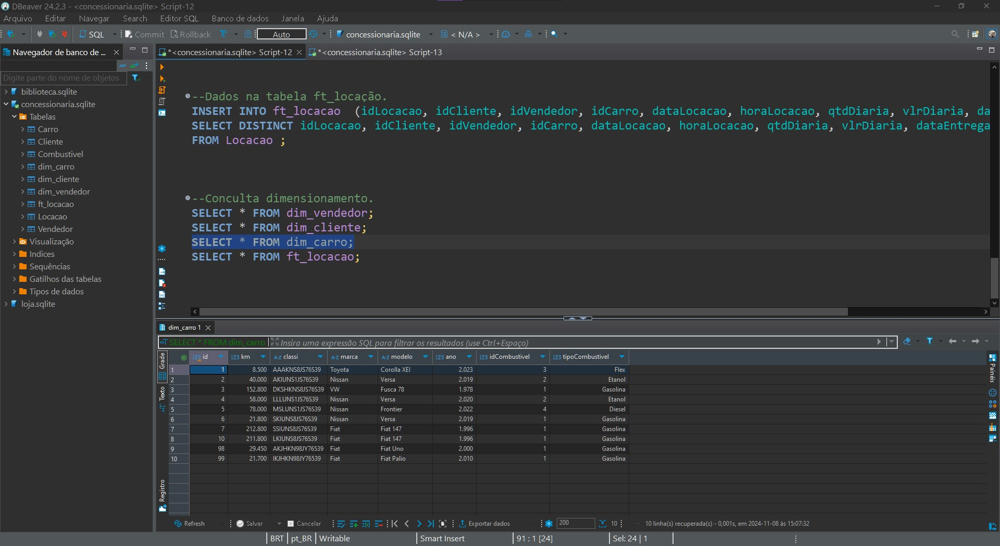
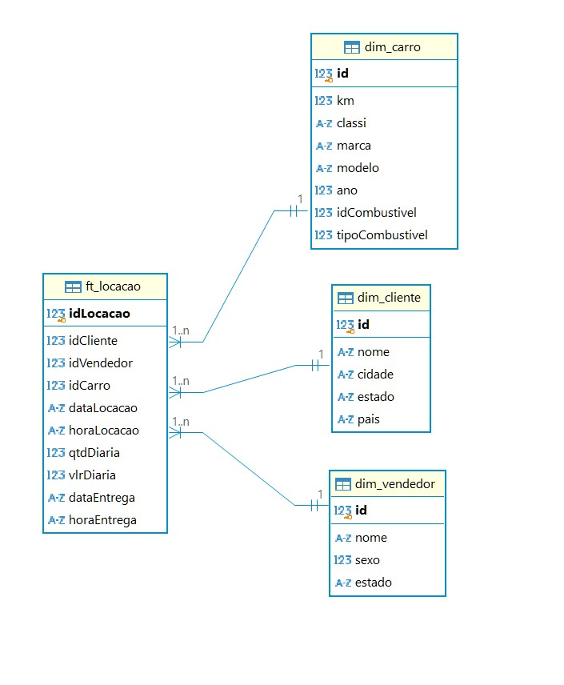

# Objetivo Desafio
Para esse desafio, recebi um arquivo criptografado chamado concessionaria.zip, que contem um banco de dados.
O objetivo foi analisar e trabalhhar os dados para gerar duas modelagens, a relacional e a dimencional. 

Entregando como resolução do desafio:

- Passos da normalização.
- Desenho da Modelagem Relacional após a normalização.
- Desenho da Modelagem Dimencional.

# Etapas
Após ler diversas vezes e assistir ao video explicativo do desafio, entendi o que era necessário fazer para a conclusão do desafio.

## [Etapa01](../Desafio/etapa-1/)
1. Após receber o arquivo concessionaria.zip, descompactei e abri o arquivo concessionaria.sqlite pelo Dbeaver.

Analisando a tabela e as colunas, achei melhor fazer uma modelagem pelo Dbdesigner para vizualizar melhor quais tabelas precisaria criar e quais dados precisaria normalizar.

Tive então um rascunho inicial para organizar o pensamento: [Rascunho_modelagem](../Evidencias/Modelagem_inicial.jpg)

2. Em seguida, dei inicio a criação das tabelas e a normalização dos dados, pensei em ja fazer a relação entre as tabelas novas e a tb_locação.

Nesse momento tive muita dificulade com a sintax e quais comandos usar, achei necessário realizar uma busca em outros materiais para conseguir entender melhor como fazer.

3. Após pesquisar em outros cursos da Udemy e por fora da plataforma, comecei criando a tabela vendedor e adicionando as colunas correspondentes a essa tabela, porém, quando fui inserir a chave estrangeira na tb_locacao, apareceu um erro.


Após conversar e pesquisar sobre o erro,  entendi que essa tabela tb_locacao não seria possível alterar, então, comecei criando novas tabelas para normalizar todos os dados.

4. Para criar o arquivo [Etapa01_relacional](../Desafio/etapa-1/Etapa01_Relacional.sql), comecei criando primeiro todas as tabelas necessárias, para então ir transferindo os dados da Antiga_tb_locacao para as novas e em seguida, alterando as tabelas conforme o necessário.

Percebi que haviam vários dados duplicados, o tipo date e time também precisaram ser alterados para uma melhor formatação.

Achei melhor utilizar a função a seguir para a formatação da coluna horaLocação, para que todos os números ficassem no formato HH:MM.
```sql
UPDATE Locacao 
SET horaLocacao = printf('%02d:%s', CAST(substr(horaLocacao , 1, instr(horaLocacao , ':') - 1) AS INTEGER), substr(horaLocacao , instr(horaLocacao , ':') + 1));

```
E nas colunas dataLocação e dataEntrega, formatei para que os dados ficassem no formato YYYY-MM-DD.
```sql
UPDATE Locacao 
SET dataLocacao = substr(dataLocacao, 1, 4) || '-' || substr(dataLocacao, 5, 2) || '-' || substr(dataLocacao , 7, 2);

```
Teve um momento onde percebi que os dados da coluna kmCarro estavam iconsistentes, não seria possível colocar todos os registros na tabela Carro, nesse momento optei por selecionar a última kilometragem de cada idCarro.

```sql
INSERT INTO Carro (idCarro, kmCarro, classiCarro, marcaCarro, modeloCarro, anoCarro, idCombustivel )
SELECT DISTINCT idCarro, kmCarro, classiCarro, marcaCarro, modeloCarro, anoCarro, idCombustivel 
FROM Antiga_tb_locacao 
WHERE kmCarro = (
	SELECT MAX(kmCarro)
	FROM Antiga_tb_locacao AS kmMax
	WHERE kmMax.idCarro = Antiga_tb_locacao.idCarro
) GROUP BY idCarro;

```

Fui criando cada tabela e adicionando os dados.

Tabela vendedor:


Tabela cliente:


Tabela Carro:


Tabela combustível:



Tendo como resultado o desenho relacional.


## [Etapa02](../Desafio/etapa-2/)

Assim como falado no vídeo Explicação Desafio (Seção 8, Desafio da Sprint 2), criei um novo código para fazer as alterações necessárias para criar o modelo dimencional.

Para essa etapa, achei melhor fazer novas tabelas e copiar os dados das tabelas geradas na modelagem relacional.

1. Como é possível ver no código [Etapa02_dimensional](../Desafio/etapa-2/Etapa02_dimencional.sql)
, comecei criando cada tabela e copiando as dados para as mesmas.

Como os dados ja estavam tratados e a formatação feita, achei mais fácil realizar a modelagem dimensional.

2. Uma alteração de fiz comparada com o modelo relacional, foi deixar os dados do combustível junto com a dimensão carro, sendo esse um atributo de carro.


Tendo então como resultado o desenho dimencional a seguir.



