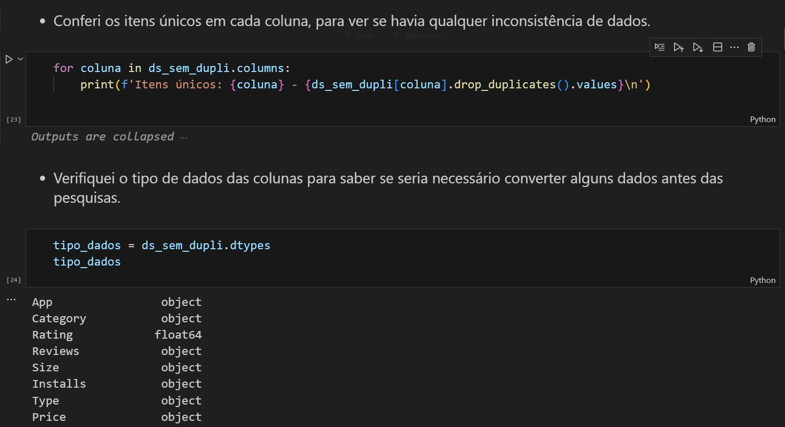

# Resumo e Objetivo

Para o desafio da sprint 03, recebi um arquivo chamado googleplaystore.csv, onde precisei preparar o ambiente de trabalhho para trabalhar com jupyter e gerar um arquivo .IPYNB, que processa dados do datatset e gera gráficos de análises.

Para isso, foi necessário instalar a extensão do jupyter no VsCode, além de bibliotecas como Pandas e Matplotlib.

# Etapas
Para esse desafio, como o entregável é um arquivo do tipo .IPYNB, todas as etapas e itens necessários foram realizados em somente um script.

## Etapa01:
A etapa 01 do desafio foi preparar o ambiente de trabalhho com as bibliotecas e extensões necessárias.

## Script_desafio... [Etapa02:](../Desafio/Etapa-2/)
A etapa 02, possui o script onde foi realizado todo o desenvolvimento do desafio.

- Comecei realizando a importação das bibliotecas e a leitura do arquivo googleplaystore.csv.

- Em seguida, achei necessário verificar as colunas e se continha linhas duplicadas e realizar sua 
remoção.

- Conferi os dados das colunas e os tipos de dados de cada coluna, para saber como precisaria trabalhar com elas.

