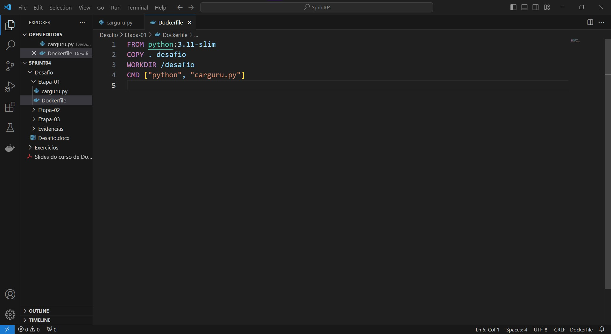
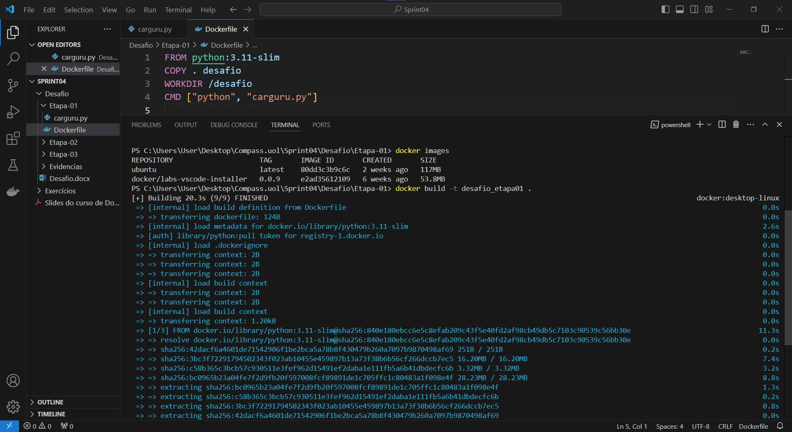
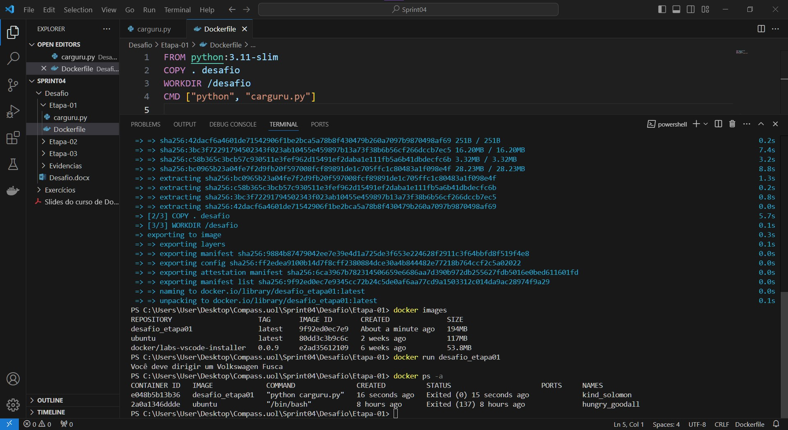
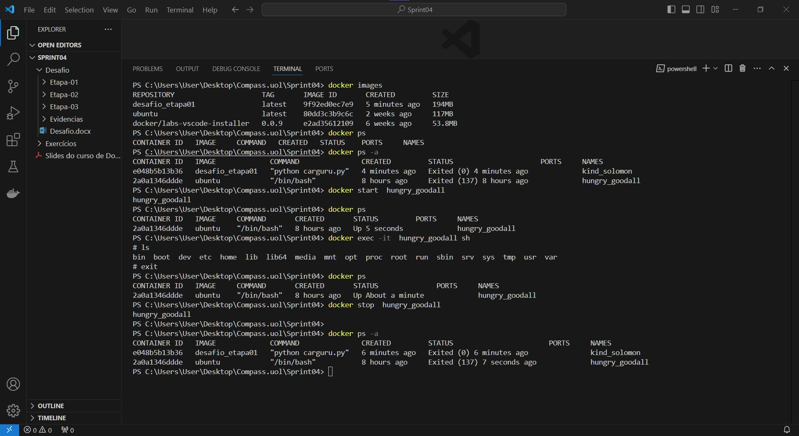
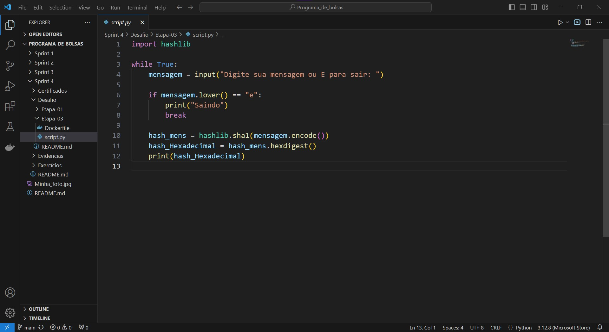

# Resumo e Objetivo

Para o desafio da sprint, recebi um arquivo chamado carguru.py para ser usado na etapa01. Para a conclusão de todas as etapas do desafio, precisei entender e praticar conceitos do docker, como criar imagens, containeers, entre outros comandos. 

# Etapas

Esse desafio ele foi dividido em 03 etapas, onde cada etapa possui um entregável distinto.

Na etapa 02 do desafio, como é uma resposta exata de como resolver, não fiz uma pasta em Desafio, deixei somente a resposta no readme.

## Etapa01: 

Na etapa 01, recebi um arquivo chamado carguru.py, onde precisei  criar uma imagem e rodar um containeer.

Para criar a imagem, criei um  dockerfile com as instruções necessárias para conter na imagem.




Para a criação da imagem, usei o comando.
```
docker build 
```


Após criar a imagem, rodei um containeer através da imagem.


## Etapa02:
Na etapa 02, foi necessário respoder a seguinte pergunta:

É possível reutilizar containers? 

Com reiniciar, entendi que após criar um conteiner e parar a execução dele, se é possível fazer com que ele rode novamente, sem a necessidade de criar um novo conainer. De acordo com o que vi no curso e entendi, é possível sim. 

Para rodar um container que ja foi criado, é necessário usar o comando:
```
docker start nome_containeer

```
Para exemplificar, fiz o comando em um containeer que criei a partir de uma imagem do Ubuntu.



## Etapa03:
Para a etapa 03, precisei criar um script.py com um algoritmo que recebe uma string via input, gera um hash e imprime esse hash de forma hexadecimal.




