# Resumo e Objetivo

Para o desafio da sprint, precisei selecionar um dataset do portal de dados públicos do Governo Brasileiro.

Após analisar, escolhi o [Declarações_de_Estoque-Camarão_656-Sudest-Sul.csv](../Desafio/Etapa-01/Declarações_de_Estoque-Camarão_656-Sudeste-Sul(Camarao%20656%20sudeste-sul).csv)

Realizei o tratamento de dados do dataset original, realizei as manipulações necessárias e enviei para o bucket, tive como entregáveis:

Script [tratamento_de_dados.py](../Desafio/Etapa-02/script_tratamendo_dados.py) e [manipulações_df.py](../Desafio/Etapa-02/script_manipulações_df.py).

Arquivo [Estoque_camarao_tratado.csv](../Desafio/Etapa-02/Estoque_camarao_tratado.csv) e arquivo [Cidade_com_maior_estoque.csv](../Desafio/Etapa-02/Cidade_com_maior_estoque.csv).

Achei interessante salvar o resultado das manipulações em um arquivo [pergunta_resposta.txt](../Desafio/Etapa-02/Pergunta_resposta.txt) para ter a pergunta e a resposta completa após as análises dos dados.


Para o upload dos arquivos para a AWS, realizei dois scripts, um [Script_de_criação_do_bucket_e_envio_csvoriginal](../Desafio/Etapa-01/aws01_bucket_dsoriginal.py) e [Script_de_envio_dos_demais_csv](../Desafio/Etapa-03/aws02_ds_tratado_manipulado.py)


# Etapas

Iniciei lendo o desafio e procurando um dataset da base de dados do Governo federal.

Dataset escolhhido:
[Declarações_de_Estoque-Camarão_656-Sudest-Sul.csv](../Desafio/Etapa-01/Declarações_de_Estoque-Camarão_656-Sudeste-Sul(Camarao%20656%20sudeste-sul).csv)

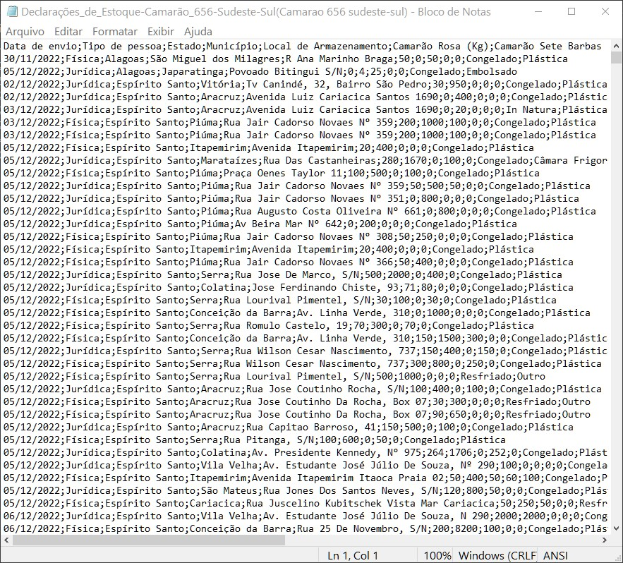


Em seguida, para uma melhor organização da resolução do exercício, dividirei os passos a seguir do desafio em etapas.

## [Etapa-01:](../Desafio/Etapa-01/) Criação do bucket e envio do dataset original.

Na primeira etapa, realizei a criação do bucket por meio de um scrippt chamado [aws01_bicket_dsoriginal](../Desafio/Etapa-01/aws01_bucket_dsoriginal.py), usando a biblioteca boto3.

Nesse script, iniciei colocando as minhas credenciais de acesso e criei um usuário s3, para realizar a criação do bucket.

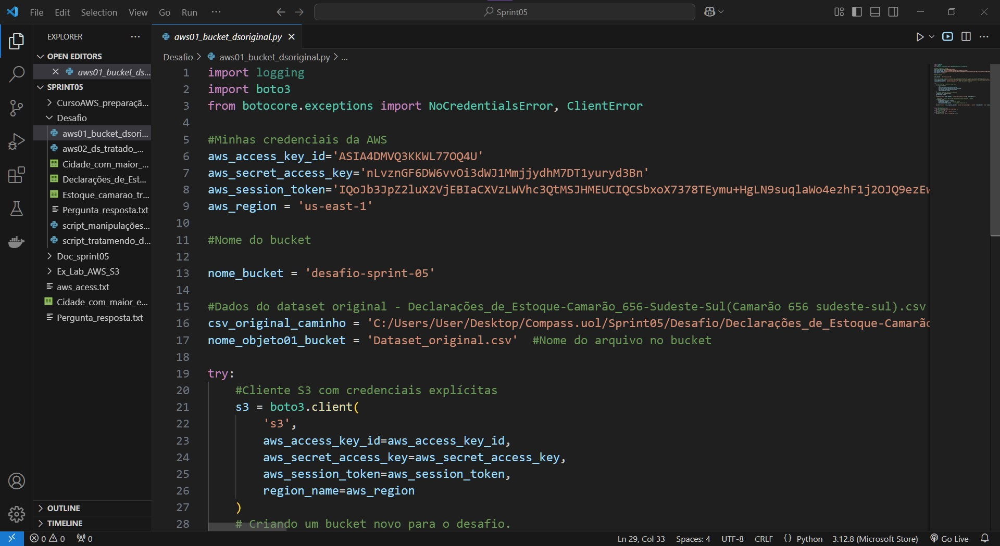

Em seguida fiz upload do dataset original para o bucket.
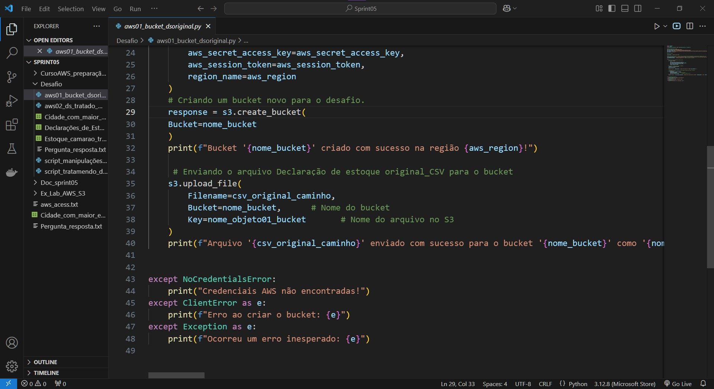

Ao rodar o script, conferi se a conexão estavva cecrta e visualizei quantos buckets já haviam no s3.
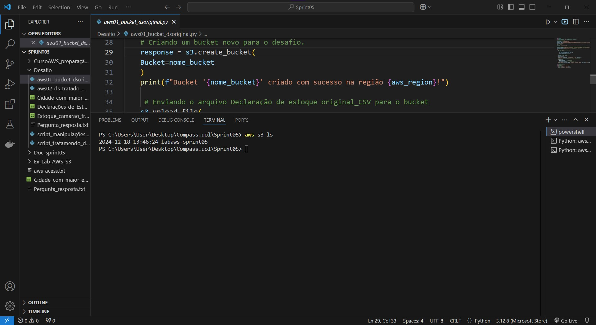

Após rodar o script, cconferi novamente se ocorreu certo a criação.
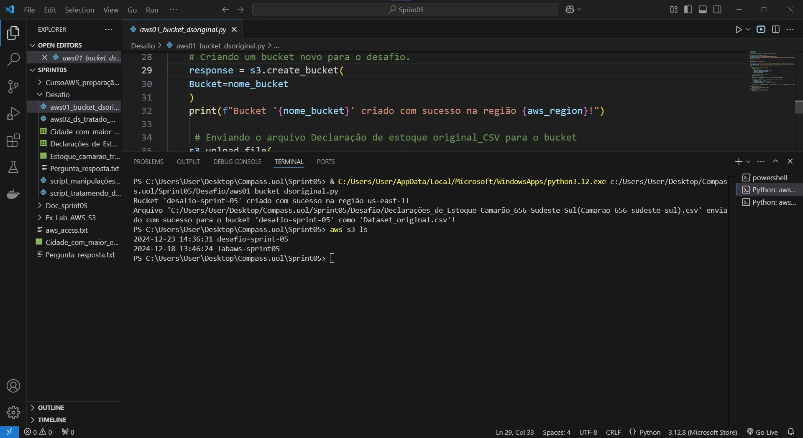

## [Etapa-02:](../Desafio/Etapa-02/) Tratamento e manipulação dos dados.

Após, realizei a análise do dataset selecionado, como vi que não tinha dados nulos e inconsistências, realizei somente a conversão do tipo dos dados de algumas colunas para numérico.

Para isso, criei um novo script e usando pandas realizei as alterações.

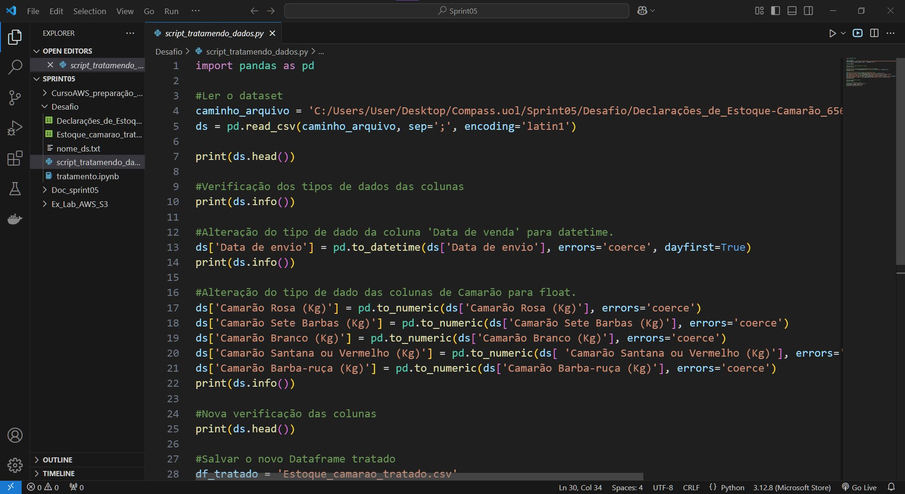


Em seguida, salvei em um novo arquivo.csv.


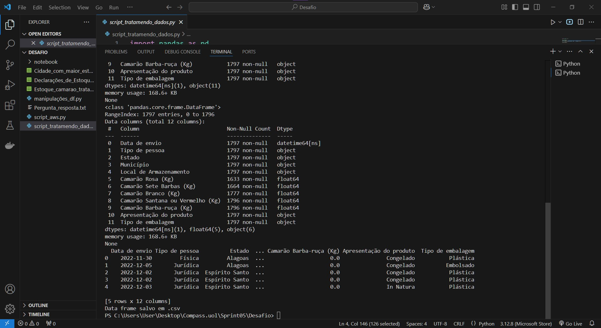

Com o dataframe novo tratado, realizei as manipulações estipuladas no enunciado do desafio.

Para isso, criei um novo script python [manipulações_df.py](../Desafio/Etapa-02/script_manipulações_df.py), onde eu conseguisse responder a questão:

-  Qual o município do estado de SP, em qual mes que esse município teve o maior estoque de camarão rosa em toneladas, além disso, qual foi a media de estoque do mesmo camarão em kg e como o estoque e classificado (Alto > 5t e Baixo <5t) ? 

Para as manipulações:

1. Comecei filtrando os dados do dataframe sendo a quantidade de camarão maior que 50kg e o estado sendo == São Paulo

2. Em seguida, realizei uma função de data, onde extrai o mês da coluna 'Data de envio'.

3. Fiz o agrupamento por 'Mes de envio' e 'Município', em seguida realizei a média e a soma da quantidade de camarão rosa em kilos. Para isso usei o trechho do código:

```
df_agrupado = df_filtrado.groupby(['Mes_envio', 'Município'], as_index=False)['Camarão Rosa (Kg)'].agg(Soma_kg_camarao_rosa='sum', Media_kg_camarao_rosa='mean')
print('Df com soma e média do camarão rosa (kg)')
print(df_agrupado.head())
```
Os itens de 1 à 3 podem ser vistos na evidência do script a seguir.

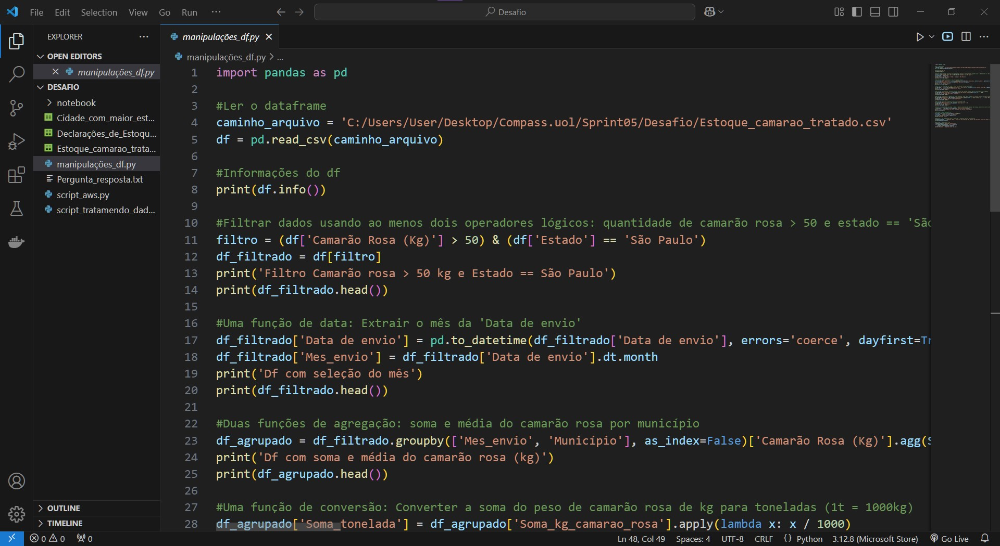

4. Converti a soma do peso do camarão, de kilos para toneladas e criei uma nova coluna chamada 'Soma_tonelada'

5. Realizei uma função condicional onde criei categorias para a coluna soma_tonelada, sendo que se for maior que 5t, é considerado um estoque Alto, caso contrário, é considerado estoque Baixo.

6. Fiz uma função de string, onde adicionei a sigla do estado (SP) ao município.

7. Inplantei um novo filtro para selecional qual o município com maior estoque do estado de São Paulo.

8. Por fim, salvei o dataframe final após todas as manipulações em csv.

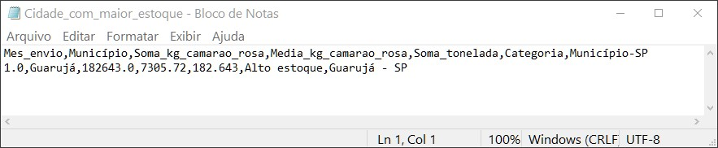

Os itens de 4 à 8 do script podem ser vistos na evidencia abaixo.

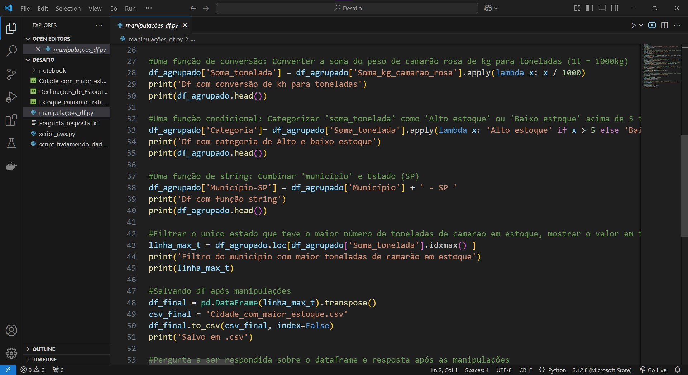

Como resultado final das manipulação, tive como saída um novo dataframe [arquivo.csv] e um arquivo [arquivo.txt] com a pergunta e a resposta.

9. Achei interessante, mesmo após salvar um arquivo em csv, realizar um print e salvar a pergunta juntamente com a resposta após todas as manipulações dos dados.

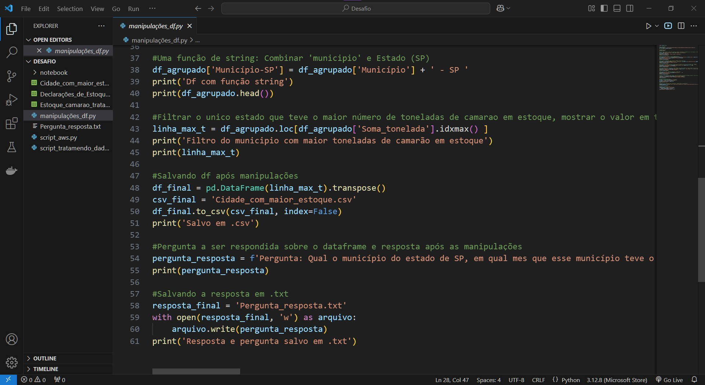

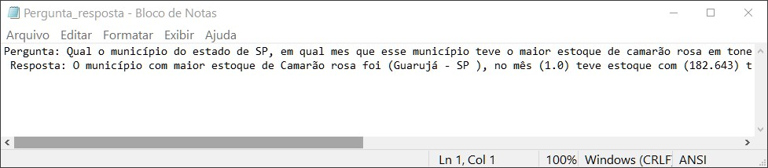


Rodando o script de manipulações, tive as saídas no terminal.

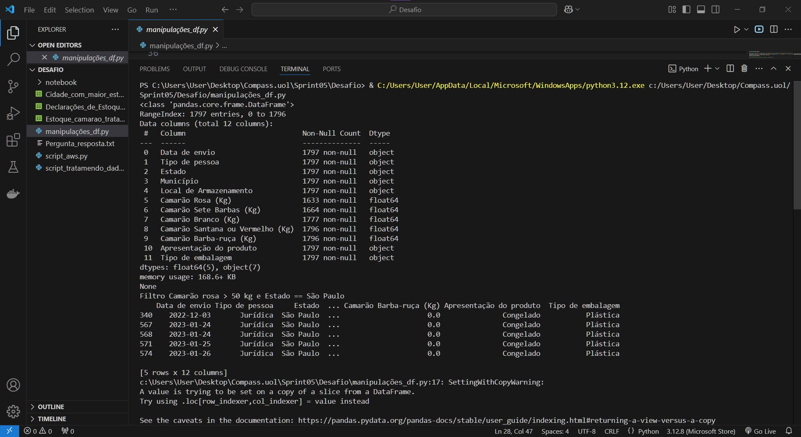

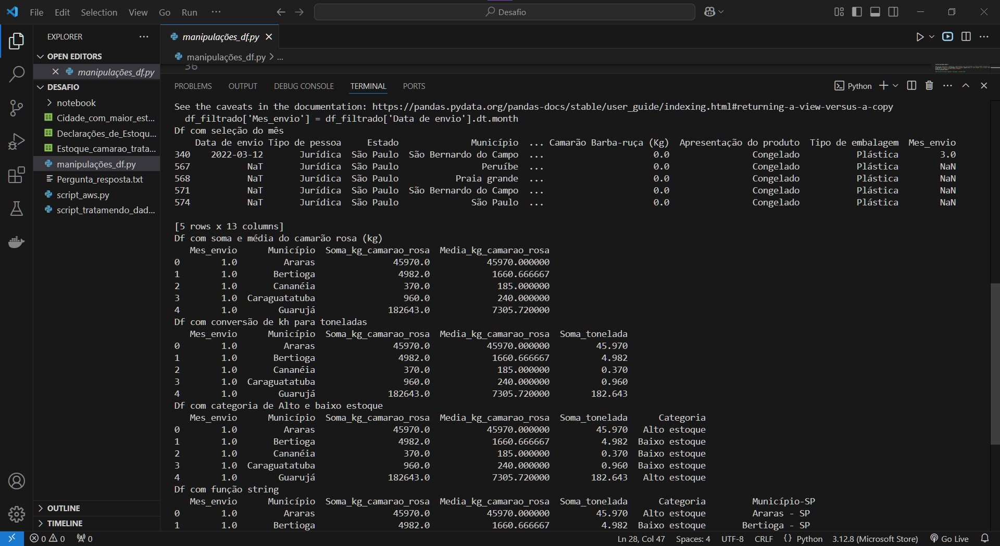

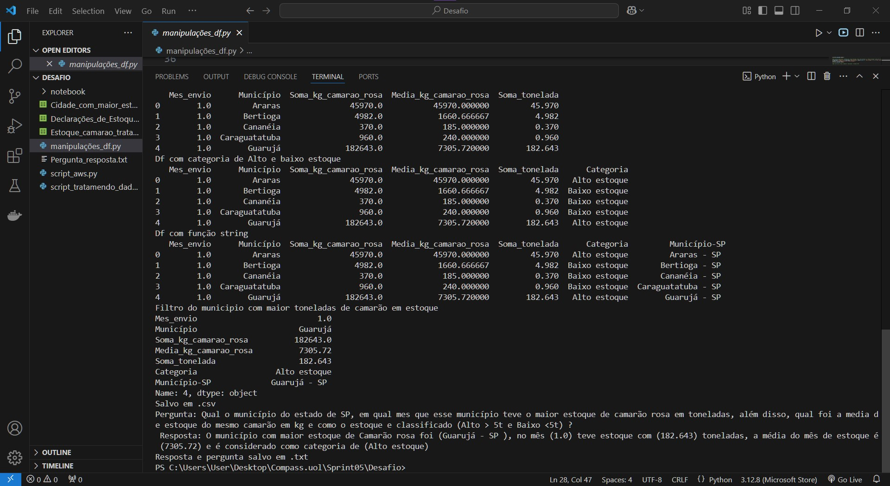

## Etapa03: Envio dos dataframe tratado e manipulado.

Por fim, após todo o processo de tratamento e manipulações, resultando em uma única resposta, enviei os dataframes para o bucket criado anteriormente.

Para isso, criei um novo script python onde usei novamente a biblioteca boto3 para enviar os arquivos na nuvem.

[aws02_ds_tratado_manipulado](../Desafio/Etapa-03/aws02_ds_tratado_manipulado.py)

Comecei o script colocando as credenciais para acesso a AWS e criei o usuário S3 com as credenciais.

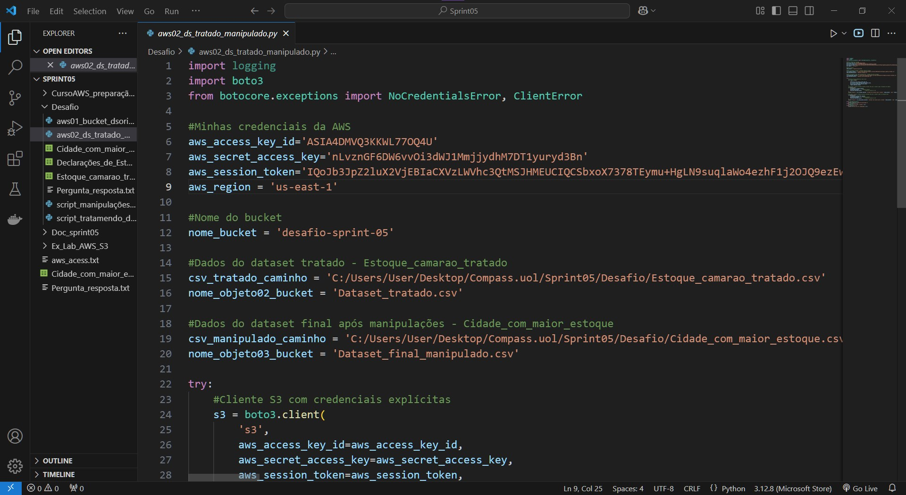

Em seguida, fiz upload do Arquivo [Estoque_camarao_tratado.csv](../Desafio/Etapa-02/Estoque_camarao_tratado.csv) e arquivo [Cidade_com_maior_estoque.csv](../Desafio/Etapa-02/Cidade_com_maior_estoque.csv).

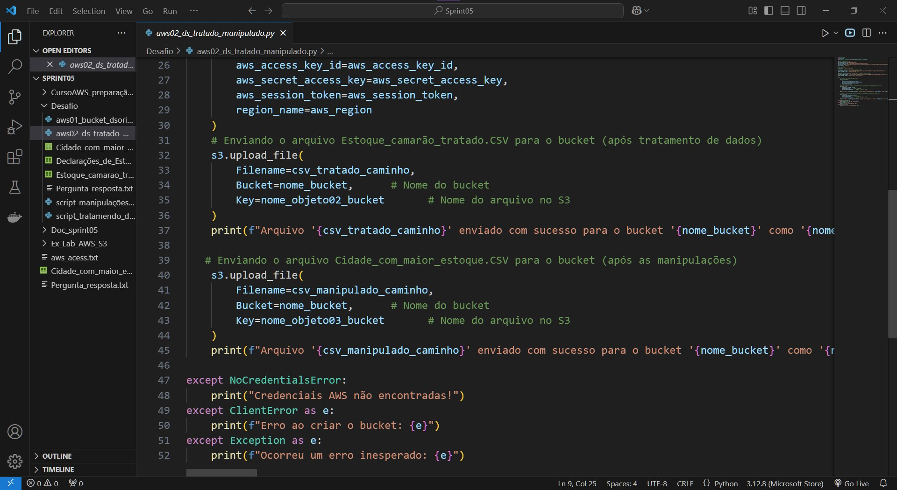

Ao rodar o script, tive como saída no terminal:

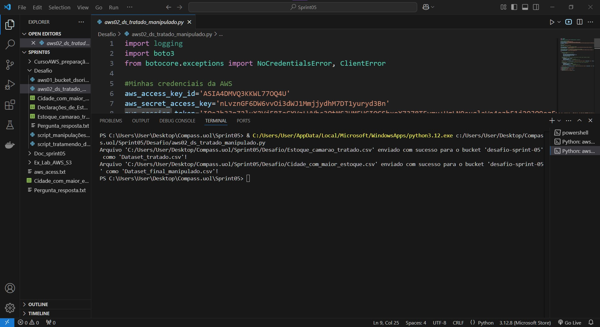

Para confirmar que tudo ocorreu corretamente, entrei no serviço S3 da AWS e conferi.

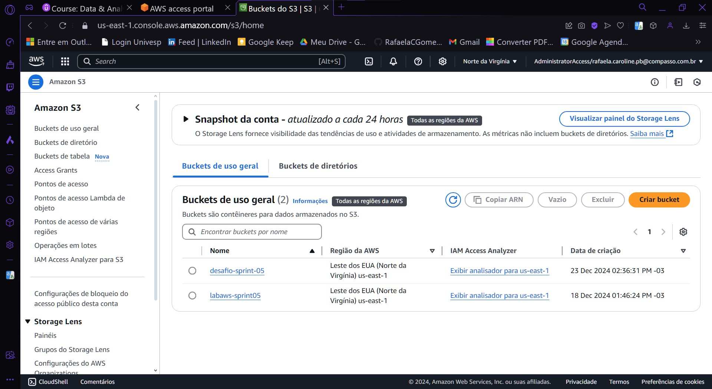

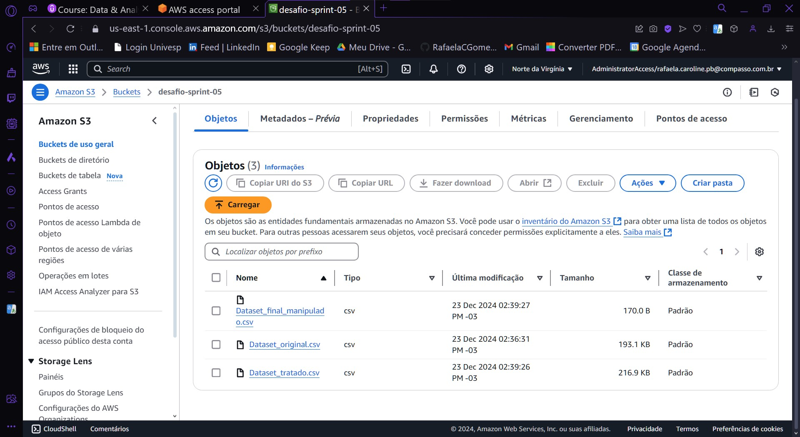


