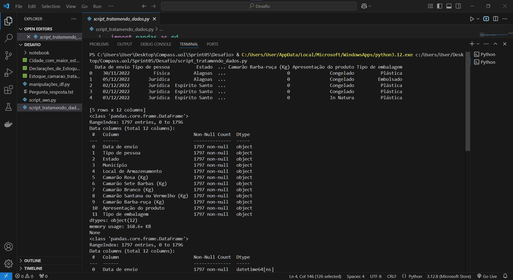

# Resumo e Objetivo

Para o desafio da sprint, precisei selecionar um dataset do portal de dados públicos do Governo Brasileiro.

Após analisar, escolhi o [Declarações_de_Estoque-Camarão_656-Sudest-Sul.csv](../Desafio/Etapa-01/Declarações_de_Estoque-Camarão_656-Sudeste-Sul(Camarao%20656%20sudeste-sul).csv)

Realizei o tratamento de dados do dataset original, realizei as manipulações necessárias e enviei para o bucket, tive como entregáveis:

Script [tratamento_de_dados.py](../Desafio/Etapa-02/script_tratamendo_dados.py) e [manipulações_df.py](../Desafio/Etapa-02/script_manipulações_df.py).

Arquivo [Estoque_camarao_tratado.csv](../Desafio/Etapa-02/Estoque_camarao_tratado.csv) e arquivo [Cidade_com_maior_estoque.csv](../Desafio/Etapa-02/Cidade_com_maior_estoque.csv).

Achei interessante salvar o resultado das manipulações em um arquivo [pergunta_resposta.txt](../Desafio/Etapa-02/Pergunta_resposta.txt) para ter a pergunta e a resposta completa após as análises dos dados.

Para o upload dos arquivos para a AWS, realizei dois scripts, um [Script_de_criação_do_bucket_e_envio_csvoriginal](../Desafio/Etapa-01/aws01_bucket_dsoriginal.py) e [Script_de_envio_dos_demais_csv](../Desafio/Etapa-03/aws02_ds_tratado_manipulado.py)

# Etapas

Iniciei lendo o desafio e procurando um dataset da base de dados do Governo federal.

Dataset escolhhido:
[Declarações_de_Estoque-Camarão_656-Sudest-Sul.csv](../Desafio/Etapa-01/Declarações_de_Estoque-Camarão_656-Sudeste-Sul(Camarao%20656%20sudeste-sul).csv)

Em seguida, para uma melhor organização da resolução do exercício, dividirei os passos a seguir do desafio em etapas.

## [Etapa-01:](../Desafio/Etapa-01/) Criação do bucket e envio do dataset original.

Na primeira etapa, realizei a criação do bucket por meio de um scrippt chamado [aws01_bicket_dsoriginal](../Desafio/Etapa-01/aws01_bucket_dsoriginal.py), usando a biblioteca boto3.

Nesse script, iniciei colocando as minhas credenciais de acesso e criei um usuário s3, para realizar a criação do bucket.

Em seguida fiz upload do dataset original para o bucket.

Ao rodar o script, conferi se a conexão estavva cecrta e visualizei quantos buckets já haviam no s3.

Após rodar o script, cconferi novamente se ocorreu certo a criação.

## [Etapa-02:](../Desafio/Etapa-02/) Tratamento e manipulação dos dados.

Após, realizei a análise do dataset selecionado, como vi que não tinha dados nulos e inconsistências, realizei somente a conversão do tipo dos dados de algumas colunas para numérico.

Para isso, criei um novo script e usando pandas realizei as alterações.

Em seguida, salvei em um novo arquivo.csv.

Com o dataframe novo tratado, realizei as manipulações estipuladas no enunciado do desafio.

Para isso, criei um novo script python [manipulações_df.py](../Desafio/Etapa-02/script_manipulações_df.py), onde eu conseguisse responder a questão:

-  Qual o município do estado de SP, em qual mes que esse município teve o maior estoque de camarão rosa em toneladas, além disso, qual foi a media de estoque do mesmo camarão em kg e como o estoque e classificado (Alto > 5t e Baixo <5t) ? 

Para as manipulações:

1. Comecei filtrando

2. dados 

3. agregação

4. conversão

5. condicional

6. string

7. novo filtro

8. salvando manipulações csv

Como resultado final das manipulação, tive como saida um novo dataframe [arquivo.csv] e um arquivo [arquivo.txt] com a pergunta e a resposta.

9. pergunta e resposa

Rodando o scrip de manipulações, tive as saídas no terminal.

## Etapa03: Envio dos dataframe tratado e manipulado.

Por fim, após todo o processo de tratamento e manipulações, resultando em uma unica resposta, enviei os dataframes para o bucket criado anteriormente.

Para isso, criei um novo script python onde usei novamente a biblioteca boto3 para enviar os arquivos na nuvem.

[script_aws_2]

![]

