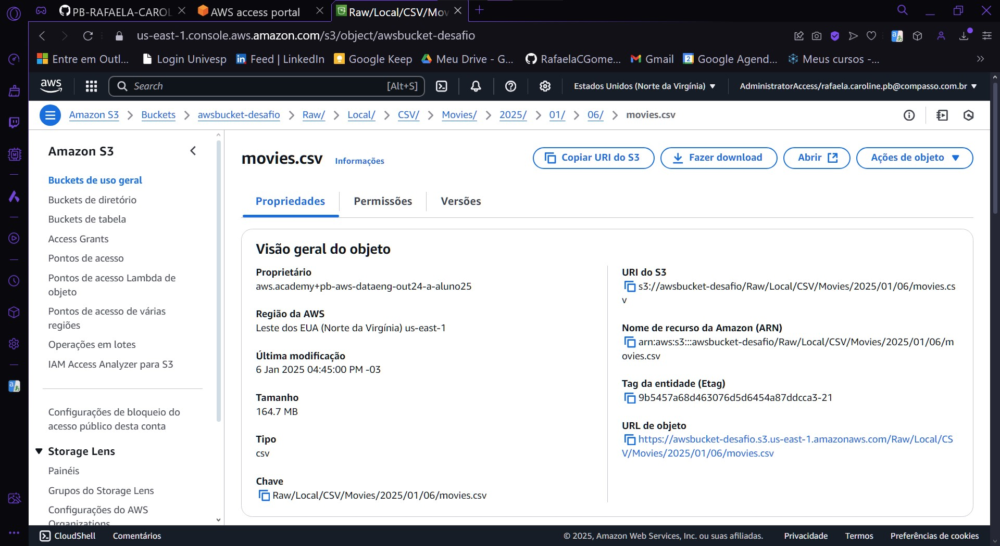
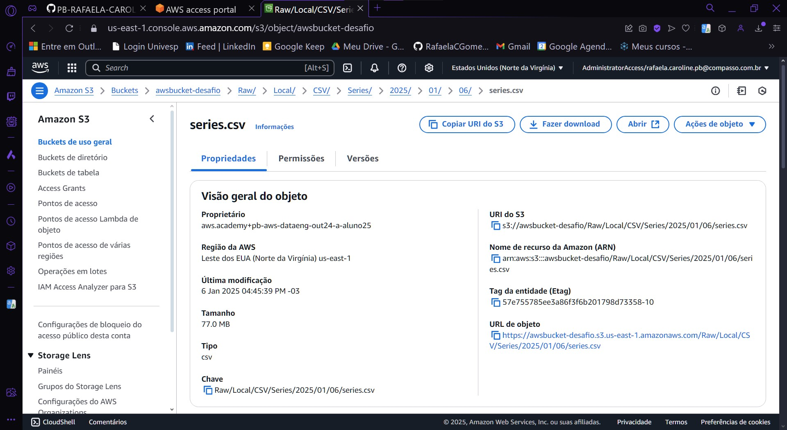

# Resumo e Objetivo

O desafio da sprint 06 se tratou de baixar um arquivo zip disponibilizado na plataforma Udemy, onde após extrair foi encontrado dois arquivos .csv, um chamado movies.csv e outro chamado series.csv

Precisei ler os arquivos inteiros, sem realizar a filtragem de dados e carregar esses arquivos para um bucket s3 através de um script python. 

Além disso, precisei criar uma imagem que contenha o script.py e os arquivos csv e rodar um container para executar o script.

Como entregáveis, achei melhor não colocar os arquivos originais baixados, uma vez que são padrão para todos e pensando no tamanho de cada arquivo.

Tendo assim:

[Script_pyhton](../Desafio/Etapa-01/script.py) - Que carrega os arquivos para o bucket.

[Dockerfile](../Desafio/Etapa-02/Dockerfile) - Usado para criar a imagem docker.

Após abrir e analizar os arquvios movies.csv e series.csv, fiz algumas análises breves e decidi realizar minhas perguntas com base na franquia Star Wars.

Minha escolha foi partes por eu gostar bastante da franquia e acabei tendo a ideia de ir a fundo em analisar os gastos dos filmes, comparar seus gastos com seus lucros e, além disso, por se tratar de uma franquia muito conhecida, na época em que começou a ser lançada, não havia tanta tecnologia na área cinematográfica, me surgiu uma dúvida em saber, qual a diferença em gastos e lucros comparando com produções mais recentes, pensando na tecnologia usada e o gosto do público com filmes de fantasia.

Tendo assim como pensamento central: Os filmes da franquia Star Wars tiveram grandes alterações na sua receita considerando a época de lançamento e os gastos, assim como outros atores/atrizes tiveram muitas diferenças em sua receita ao comparar os filmes da franquia com outras produções, com o intuíto de entender se o sucesso da franquia está ligado com os recursos gastos ou não.

Com base nesse pensamento, desenvolvi algumas perguntas:

1. Qual foi o gasto e o lucro recebido da primeira produção de Star Wars?

2. Qual foi o gasto e o lucro recebido pela última produção da franquia Star Wars?

3. Levando em consideração a atriz Carrie Fisher, qual foi a maior receita recebida em sua participação e em qual produção foi da franquia Star Wars, e ao comparar com outra receita da mesma atriz em participação de produções fora da franquia, qual foi de maior rendimento?

4. Comparar o gasto médio por década de lançamento das produções dos filmes da franquia Star Wars e comparar os gastos com os lucros média por década dos mesmos.

5. Os filmes lançados da franquia Star Wars na década de 70 tiveram maior ou menor nota comparado com os lançamentos mais recentes da franquia?

# Etapas

## [Etapa1: Criação do código Python](../Desafio/Etapa-01/)

1. Após baixar e extrair os arquivos da plataforma, analisei brevemente os movies.csv e series.csv.


2. Criei manualmente um bucket s3 na AWS.


3.  Em seguida, criei um arquivo script.py onde, através dele enviei esses arquivos movies.csv e series.csv para o bucket.

Ao criar o script, pensei em formas de não deixar as credenciais expostas no código, decidi então receber as credenciais por input.

````
aws_access_key_id=input("Digite sua AWS ACCESS KEY ID: ").strip()
aws_secret_access_key=input("Digite sua AWS SECRET ACESS KEY: ").strip()
aws_session_token=input("Digite sua SESSION TOKEN: ").strip()
````

Para o caminho pedido no desafio, usei variáveis que fornece a data (Ano/Mes/Dia)

```
data = datetime.now()
ano = data.strftime('%Y')  # Ano atual do processamento
mes = data.strftime('%m')   # Mês atual do procesamento
dia = data.strftime('%d')   # Dia atual do processamento
```

E defini variáveis para completar o caminho.

```
camada_armazenamento = 'Raw'
origem_dados = 'Local'
formato_dados = 'CSV'
```

Ao chamar a função, formatei o caminho no bucket.

```
#Movies
especificacao_dados_movies = 'Movies'
caminho_local_movies = '/app/movies.csv'
s3_caminho_movies = f"{camada_armazenamento}/{origem_dados}/{formato_dados}/{especificacao_dados_movies}/{ano}/{mes}/{dia}/movies.csv"
```

Esse script, inicialmente rodei localmente para ver se os comandos estavam funcionando corretamente e enviando para o bucket.

Em seguida realizei as alterações necessárias, pensando que ele estará sendo executado dentro de um container Docker, tendo como script final: [script.py](../Desafio/Etapa-01/script.py)


## [Etapa2: Criação docker](../Desafio/Etapa-02/)

1. Em seguida criei um arquivo [Dockerfile](../Desafio/Etapa-02/Dockerfile) para criar uma imagem Docker onde armazenaria os arquivos csv e o script.py.


2. Com o Dockerfile pronto, criei a imagem.


3. Confirmei a criação da imagem.


4. Em seguida carreguei um container e verifiquei se estava tudo correto.


5. Por fim, verifiquei o envio diretamente na plataforma da AWS.






