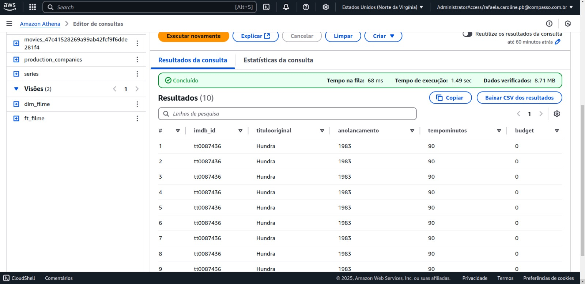
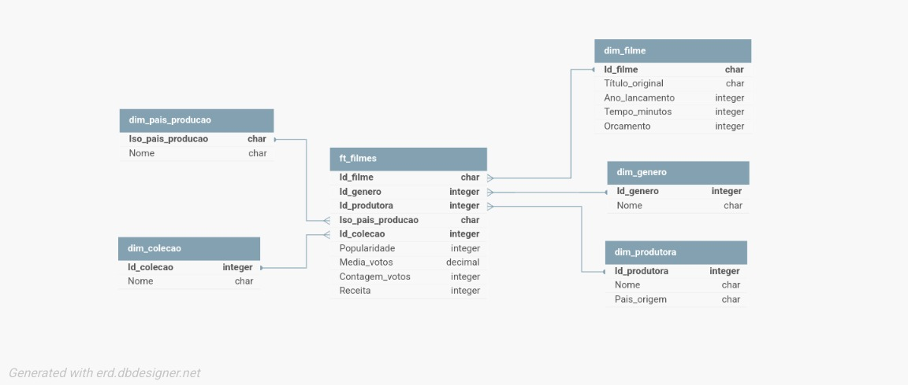

# Resumo e Objetivo
 
O desafio da sprint 9 consistiu em realizar job no GLue para criar uma nova camada chamada Refined com as colunas necessárias para a realização da análise com base nos dados da camada Trusted.

# Etapas

## Etapa 1
Iniciei o desafio realizando consultas no Athena as tabelas criadas na sprint 8, para definir quais colunas irei usar na modelagem e quais tratamentos será necessário realizar.

Em seguida criei views das tabelas que vou utilizar no dimensionamento dos dados.

View da tabela fato filmes

View da dimensão filme

View da dimensão gênero

View da dimensão produtora

View da dimensão pais produtora
Nessa tabela percebi que precisaria explodir a coluna para desmenbrar o iso do pais e o nome, criando uma tabela com o id e o nome, e manter na fato somente o id.

O mesmo será necessário fazer para a dimensão coleção.

## Etapa 2
Usando o modelo das views criadas no Athena e usando o DbDesigner online, criei um desenho da modelagem criada.

Tendo como resultado:

## Etapa 3
Iniciei então a escrita do script do job do Glue.

