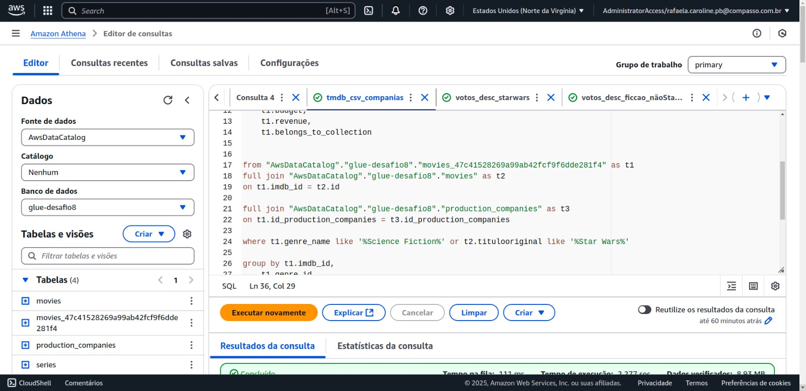
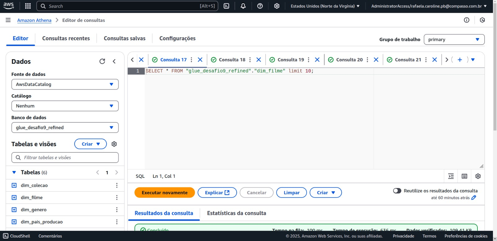

# Resumo e Objetivo
 
O desafio da sprint 9 consistiu em realizar job no GLue para criar uma nova camada chamada Refined com as colunas necessárias para a realização da análise com base nos dados da camada Trusted.

Como entregável, tenho o [script_glue_refined.py](./Scripts/script_glue_refined.py) e o [desenho da modelagem](../Evidencias/modelo_dimensional.jpeg).

# Etapas

## Etapa 1
Iniciei o desafio realizando consultas no Athena as tabelas criadas na sprint 8, para definir quais colunas irei usar na modelagem e quais tratamentos será necessário realizar.




Em seguida criei views das tabelas que vou utilizar no dimensionamento dos dados.

View da tabela fato filmes


View da dimensão filme


View da dimensão gênero


View da dimensão produtora


View da dimensão pais produtora
Nessa tabela percebi que precisaria explodir a coluna para desmenbrar o iso do pais e o nome, criando uma tabela com o id e o nome, e manter na fato somente o id.

O mesmo será necessário fazer para a dimensão coleção.


## Etapa 2
Usando o modelo das views criadas no Athena e usando o DbDesigner online, criei um desenho da modelagem criada.

Tendo como resultado:


## Etapa 3
Antes de ir para a AWS, criei um código que realizasse o tratamendo e criasse as colunas que quero, testando primeiro no Google Colab, após esse teste, fui para a plataforma da AWS.

Iniciei criando um novo database para a sprint 9.


Em seguida, criei um novo job glue para o desafio.


Declarei os parâmetros necessários para o glue.


Salvei os parâmetros e iniciei a escrita do job.


Comecei importando as bibliotecas necessárias, declarando os parâmetros e os paths de entrada e saída.


Em seguida, abri os parquet de origem da camada Trusted e criei um DynamicFrame para cada parquet lido.


Converti cada DynamicFrame para dataframe para fazer os tratamentos das colunas e criação das tabelas necessárias conforme a modelagem, para isso usei o seguinte trecho:
```
#Converte DynamicFrame em dataframe.
movies_local_df = df_dynamic_movies_local.toDF()
movies_tmdb_df = df_dynamic_tmdb_movies.toDF()
companies_tmdb_df = df_dynamic_tmdb_companies.toDF()
```

Tendo então 3 dataframes, um para o parquet de origem csv, um para movies de origem TMDB e um para companies de origem TMDB, isso pois na sprint passada eu ter particionado o TMDB em dois parquet.

Ao analisar as colunas, percebi que precisaria retirar algumas colunas de "belongs_to_collections" e "revenue", porém essas colunas não eram array e não consegui explodir elas, precisei então selecionar as colunas necessárias de cada um para conseguir utilizar os dados e em seguida deletar a coluna.


Em seguida, explodi a coluna production_contrie, pois precisava manter a relação entre ISO e nome do país.

```
#Explodir a coluna production_contrie porém mantendo a relaçao entre iso e nome.
movies_tmdb_df = movies_tmdb_df.withColumn("country", explode(col("production_countries")))
```
Comecei criando o Dataframe da tabela fato_movies, selecionando as colunas que quero de acordo com a modelagem.


Para a dimensão filme, fiz o join entre o parquet de origem csv e tmdb, para isso, selecionei as colunas que quero de cada dataframe e fiz o join usando o Id como chave.

Em seguida retirei as duplicatas.


Para a dimensão genero, usei o seguinte trecho de código para selecionar as colunas id_genero e nome_genero.
```
#criar Dataframe da tabela dim_gereno (parquet3)
parquet3_df = movies_tmdb_df.select(
    col("genre_id").alias("Id_genero"),
    col("genre_name").alias("Nome_genero")).dropDuplicates()
```

Continuei separando os dataframes, criando a dimensão produtora, sendo que para essa dimensão, peguei as colunas que haviam sido particionada do TMDB na camada Trusted.
```
# Criar DataFrame da tabela dim_produtora (parquet4)
parquet4_df = companies_tmdb_df.select(
    col("id_production_companies").alias("Id_produtora"),
    col("name").alias("Nome_produtora"),
    col("origin_country").alias("Pais_origem")).dropDuplicates()
```

Criei também as dimesões pais_produção e coleção.
```
#criar Dataframe da tabela dim_pais_producao (parquet5)
parquet5_df = movies_tmdb_df.select(
    col("country.iso_3166_1").alias("Iso_pais_producao"),
    col("country.name").alias("Nome_pais")).dropDuplicates()

#criar Dataframe da tabela dim_colecao (parquet6)
parquet6_df = movies_tmdb_df.select(
    col("id_colecao").alias("Id_colecao"),
    col("nome_colecao").alias("Nome_colecao")).dropDuplicates()
```
Garanti que cada dataframe de cada tabela seja salva somente em um parquet para cada.

Achei interessante criar um dicionário com o nome da tabela e o dataframe referente a cada tabela. Fiz isso para conseguir realizar o salvamento de todos os parquets de forma eficiente.


Utilizando o dicionário criado, interei sobre cada registro do dicionário e converti novamente para DynamicFrame cada dataframe.
```
#converter de volta para DynamicFrame
dynamic_frames = {name: DynamicFrame.fromDF(df, glueContext) for name, df in dataframes.items()}
```
E por último, interei por cada registro do dicionário de dynamic_frames para declarar o path de saída, tendo subdiretórios para cada parquet e salvando cada registro em parquet no s3, na camada Refined.
```
#salvar cada parquet em uma pasta do s3
output_paths = {name: f"{s3_output_path_refined}/{name}" for name in dataframes}

for name, dynamic_frame in dynamic_frames.items():
    glueContext.write_dynamic_frame.from_options(
        frame=dynamic_frame,
        connection_type="s3",
        connection_options={"path": output_paths[name]},
        format="parquet"
    )


job.commit()
```

Após alterar o código, rodei o job no glue, tive alguns erros, como ter chamado a coluna com formatação diferente.


Tive erro também ao criar e chamar os registros do dicionário criado, conseguindo alterar e resolver o problema.


Após todas as modificações feitas, rodei o job novamente e tive sucesso.


No bucket s3, após rodar o glue, obtive o seguinte resultado.


Criei Crawlers para gerar as tabelas no database.


Rodei a crawler


E conferi se as tabelas foram criadas no database e realizei consultas no Athena para conferir as tabelas.


