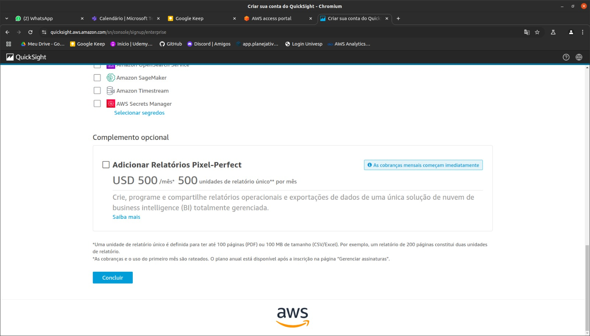
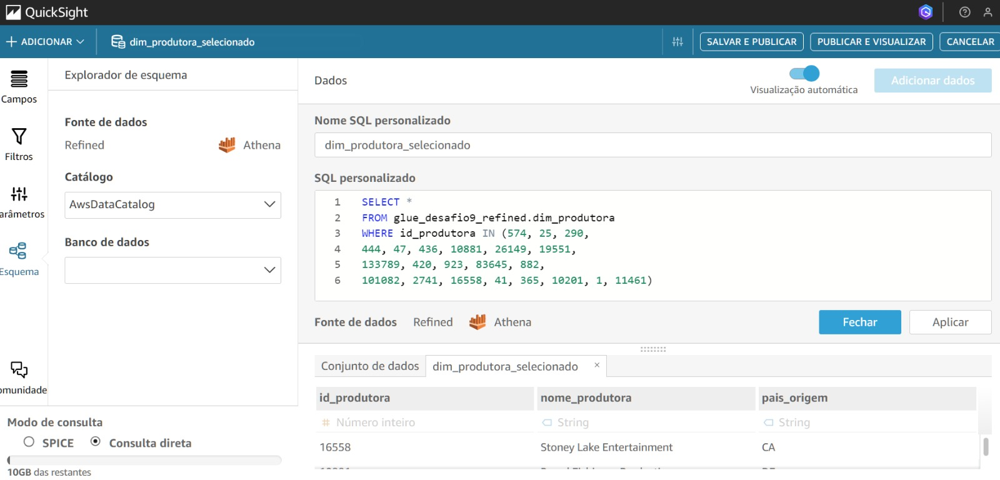
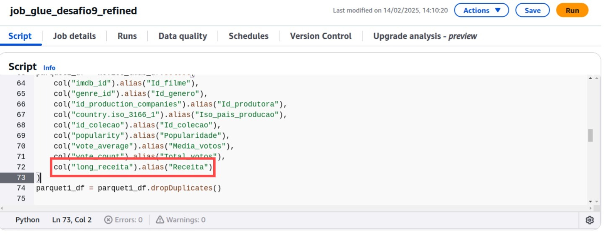

# Resumo e Objetivo
 
O desafio da sprint 10 tratou-se de realizar a vizualização dos dados, respondendo as perguntas anteriormente realizadas para a análise dos dados de acordo com o tema de cada squad.

Como entregável [Dashboard_desafio_final](./dashboard/Dashboard_desafio_final.pdf)


# Etapas
Para a construção final desse dachboard, segui alguns passos.

## Etapa 1
Comecei o desafio realizando a criação ca minha conta no AWS QuickSight, seguindo as orientações do desafio.




## Etapa 2
Em seguida, fui ao Athena e realizei consultas para saber quais são os filmes de maior votos da coleção Star Wars e demais filmes fora da coleção.


Com essas consultas, decique que trabalharei em minha análise com os 8 filmes da coleção Star Wars, comparado com os 8 filmes do mesmo gênero, porém de outras coleções.

Com isso, fiz uma relação dos filmes utilizados.


## Etapa 3
Com base nessa relação, fui criando os conjuntos de dados no QuickSight, buscando-os do athena, porém usando SQL personalizado para pegar somente os dados referente a esses filmes selecionados para a análise.





Após, obtive todos os conjuntos de dados disponíveis no QuickSight.


Realizei a junção desses dados para ter somente um conjunto com as tabelas interligadas pelas chaves primárias.


## Etapa 4
Com os dados prontos e inseridos no QuickSight, iniciei a construção dos gráficos do dashboard.

Nesse momento, ao iniciar a construção dos gráficos, me deparei com um erro nos dados.

Ao criar o gráfico de análise comparatva entre o orçamento e a receita, a receira do filme Avatar não estava preenchida.


Realizei algumas pesquisas no Athena e rodando o script do glue, responsável por criar a camada Refined, passo a passo no Google colab, consegui encontrar o erro.

Observei que ao selecionar as colunas para separar da coluna Revenue, de origem TMDB, havia int_receita e long_receita, eu selecionei para adicionar no meu dataframe referente a minha tabela fato, a coluna int_revenue, que, exclusivamente nesse filme, está como NULL.


Por conta disso, a coluna Receita do filme Avatar se encontra como NULL, por não conter no TMDB.

Com isso, rodei novamente o script para recriar a camada Refined. Refazendo em seguida as Crawler e criando novas tabelas para serem usadas no QuickSight.




Após consultar no Athena, observei que não houve a busca da receita dos outros filmes, pois não possuem a coluna long_receita.
Com isso, rodei novamente o glue e crawler, dessa vez, convertendo a coluna int_receita para long e criando uma coluna que junta as colunas long e int dos filmes.
Para isso utilizei:
```
#Converter int_receita para long e juntar int_receita e long_receita em receita_final.
movies_tmdb_df = movies_tmdb_df.withColumn("receita_final", coalesce(col("int_receita").cast(LongType()), col("long_receita")))
```


Em seguida, rodei novamente crawler e a consulta no Athena.


## Etapa 5
Voltei para o QuickSight, atualizei o conjunto de dados e continuei a criação do Dashboard.

Tentei seguir pelo dashboard todo, um padrão de cores, sendo Azul escuro para os filmes da coleção Star Wars e Cinza escuro para os filmes de outras coleções.

Com base nas perguntas, iniciei o dashboard colocando informações para contextualizar os dashboard.
Achei interessante colocar um gráfico de pizza para demonstrar que do total de filmes analisados, está dividido igualmente entre gênero Star Wars e demais gêneros.


Em seguida, os gráficos "Filmes e seus anos de lançamento" responde parcialmente a pergunta:
```
 1- Quais são os anos de lançamentos dos filmes da coleção Star Wars? Qual filme da coleção teve o maior gasto para ser produzido (orçamento) e qual filme teve a maior receita?
```


Já o segundo gráfico, chamado "Total de votos X popularidade por filme" responde as perguntas:
```
2- Qual o filme da coleção teve maior votos?

3- A popularidade dos filmes da coleção Star Wars, tem o mesmo padrão que os votos totais?
```

Em seguida, volto a pergunta:
```
1- Quais são os anos de lançamentos dos filmes da coleção Star Wars? Qual filme da coleção teve o maior gasto para ser produzido (orçamento) e qual filme teve a maior receita?
```
Fazendo assim comparação detalhada entre orçamento e receita de cada filme, separado por coleção Star Wars e demais coleções.


Em seguida respondi a pergunta:
```
4- Os filmes da coleção possuem a mesma duração?
```


A questão:
```
5- Qual a produtora dos filmes da coleção e qual o país de origem dessa produtora?
```
Foi respondida pelos gráficos a seguir, nesse momento observei que já havia descrito e padronizado no início do dashboard o país de produção analisado, então achei redundante colocar novamente o país.


O gráfico "Filmes produzidos por produtora" ajuda a responder as duas últimas questão:


```
6- Ao comparar os mesmos parâmetros utilizados anteriormente, existe algum filme, do mesmo gênero da coleção Star Wars que possui maior votação, popularidade, orçamento e receita que os filmes Star Wars entre os anos 1977 e 2016?

7- Existe algum padrão dos filmes de Sci-fi que possuem a mesma popularidade e votos que os filmes da coleção Star Wars, levando em consideração a produtora e o país de origem da produtora?
```
Essas duas últimas questões, são respondidas ao analisar todos os gráficos, pois são uma junção de informações.

A conclusão que temos ao analisar é: 

O filme Avatar, mesmo tendo maior receita, votação e popularidade, foi o filme de maior duração comparado a todos os outros. Entretanto, o filme foi produzido por diversas produtoras. 

Já os filmes da coleção Star Wars, obtiveram um orçamento médio parecido durante toda a coleção e no geral, a receita foi alta para todos os filmes. Já em relação a produtora, Lucasfilm ltda, predomina na criação dos filmes. 

Além disso, a produtora 20th Century Fox, produziu um total de 4 filmes, incluindo Avatar e Star Wars, sendo o único vínculo entre o gênero star Wars e os demais filmes analisados. 

Por fim, a coleção Star Wars, mesmo sendo bastante aclamada, acaba ficando em segundo lugar ao comparar as informações com o filme Avatar.